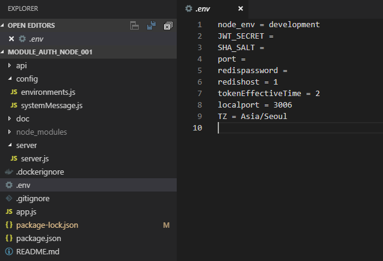
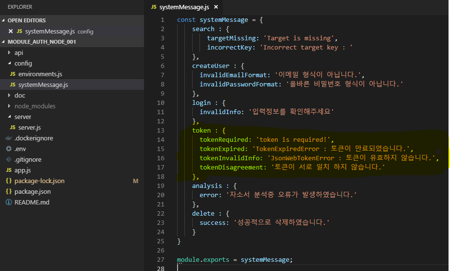

프로젝트 설정
---------------------------
* [민감정보 관리](#민감정보관리)  
* [공통 메세지 관리](#공통메세지관리)  

민감정보관리
 ---------------------------------
 

  
 

 
 1. `.env` 파일내에 maria, redis, jwt 관련 정보등을 정의하여 사용한다. Node_env 속성을 통하여 위에서 설명한 `environmemts.js` 파일내에서 로컬과 운영환경을 구분 할 수 있다. (로컬: development, 운영: production)

- `JWT_SERCRET`: JWT 비밀키
 - `SHA_SALT`: 비밀번호 해싱값
 - `port`: redis 포트번호
 - `redispassword`: redis 비밀번호
 - `tokenEffectiveTime`: 토큰 유효 기간 (시간)
 
 

공통메세지관리
---------------------------------
 

    
 

 
 1. 공통으로 사용되는 메시지는 config 폴더안에 `systemMessage.js` 파일 내에 정의하여 사용한다.
 - `tokenRequired`: 토큰값이 없을 때 출력
 - `tokenExpired`: 토큰 유효기간이 만료되었을 때 출력
 - `tokenInvalidInfo`: 토큰 길이, 형식 등 유효하지 않을 때 출력
 - `tokenDisagreement`: 토큰 값이 일치하지 않아 Refresh Token을 생성할 수 없을 때 출력
 
 
